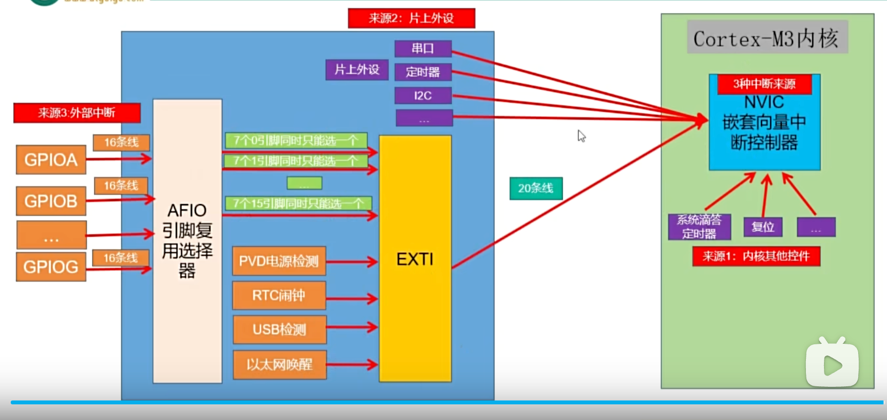
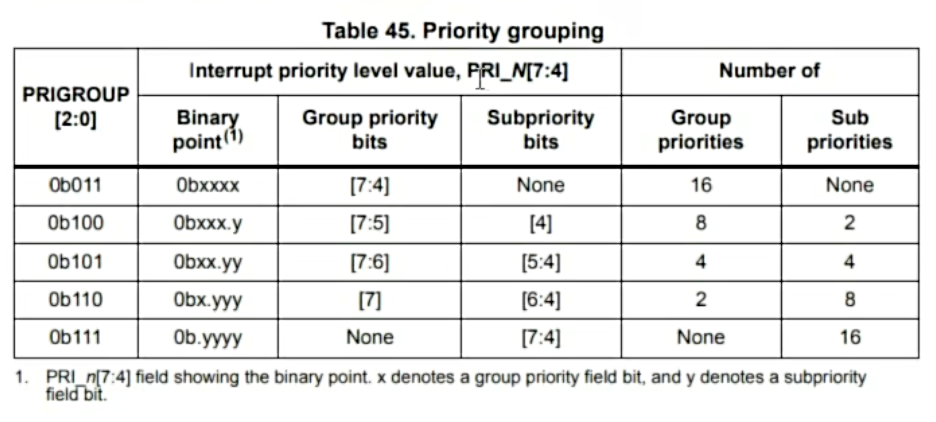
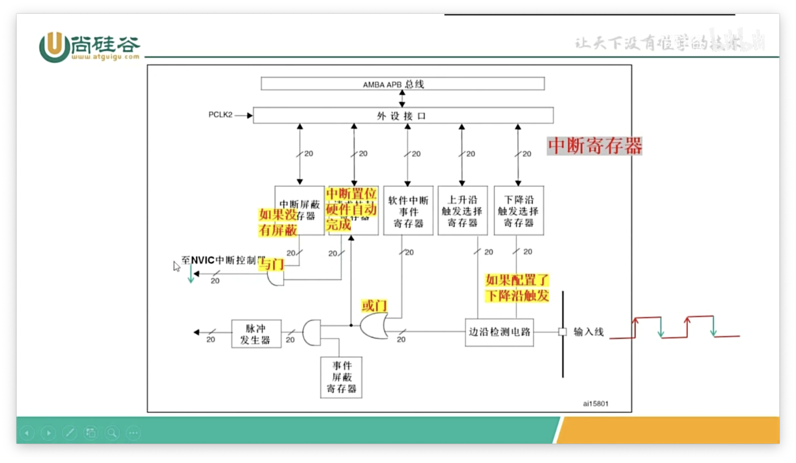
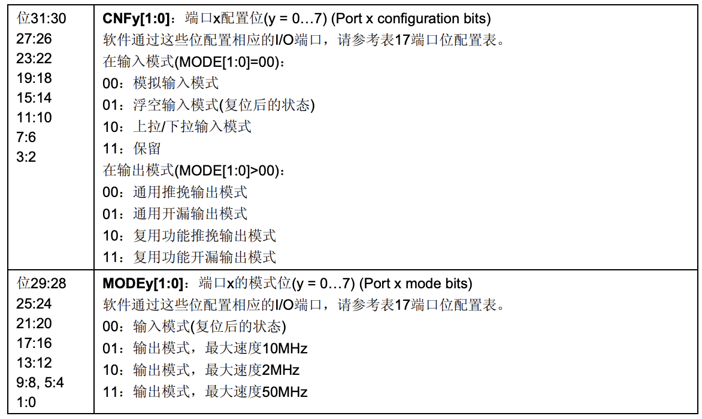

### 点亮板上的C13 LED灯
  1. RCC->APB2ENR外设时钟使能寄存器（单独的寄存器记录需要使能的外设是那个寄存器）  
  ```c
  //使能 GPIOC的外设寄存器，也就是让CPU处理这部分的, 设置为1  
  // RCC->APB2ENR |= 4; 4 -> 0000 0000 0000 0100 使能某个寄存器 第2为是GPIOA 所以使能4是使能A  
  SET_BIT(RCC->APB2ENR,RCC_APB2ENR_IOPCEN); 
  ```
  2. GPIO 工作模式
  ```c
  // 0-7 是配置低位寄存器CRL 8-15 配置高位寄存器CRH 模式需要配置输入还是输入和速度，需要占用4位，32位只能配置8个PIN因此需要分高低位寄存器设置  
  // 设置 00 通用推挽输出 clear是清除因此设置为  
  CLEAR_BIT(GPIOC->CRH,GPIO_CRH_CNF13);  
  
  // 设置 11 输出模式最大速度  
  SET_BIT(GPIOC ->CRH,GPIO_CRH_MODE13);  
  ```
  3. 配置端口输出数据寄存器ODR(输入就是IDR) （就是端口Pin设置为0输出低电位 还是1输入高电位 ，一共32位，高位的16保留，低位的16一个位对应一个PIN）  
  ```c
  // ODR 是需要修改的目标寄存器  
  // SET_BIT(GPIOC->ODR,GPIO_ODR_ODR13);//设置为1 为高电平，LED灯不亮，两端都是高电平  
  CLEAR_BIT(GPIOC->ODR,GPIO_ODR_ODR13); //复位设置为0，为低电平，LED灯亮
  ```
### 理解BSRR
  1. 端口位设置/清除寄存器BSRR（Bit Set Reset R）,一一对应ODR ，BSRR设置为1那么对应ODR寄存器会设置为0，(CLEAR_BIT设置为0，SET_BIT设置为1)  
  ```c
    //BSRR 分为BR （Bit Reset） 和BS （Bit set）  
    SET_BIT(GPIOC->BSRR,GPIO_BSRR_BR13); // 设置为1 对应ODR设置为0了低电位,  
    CLEAR_BIT(GPIOC->BSRR,GPIO_BSRR_BR13); //设置为0 对应ODR没有影响  

    SET_BIT(GPIOC->BSRR,GPIO_BSRR_BS13);// 设置为1 对应ODR设置为1了高电位  
    CLEAR_BIT(GPIOC->BSRR,GPIO_BSRR_BS13);//设置为0 对应ODR没有影响  
  ```
  2. 端口位清除寄存器BRR （Bit Reset）就是BSRR中的BR单独拿出来  
  ```c
    SET_BIT(GPIOC->BRR,GPIO_BRR_BR13); //设置为 1 对应ODR设置为1同上  
    CLEAR_BIT(GPIOC->BRR,GPIO_BRR_BR13);//设置为0 对应ODR没有影响  
  ```
### 端口配置锁定寄存器
 用于在规定时间内锁定配置（CRL,CRH）不能改变 0-15位对应端口 16位是全局锁 17~31保留
### 中断
主程序被中断，去处理中断源程序

#### NVIC 嵌套向量中断控制器
中断来源：
1. 内核其他控件
  - 系统滴答定时器
  - 复位
  - 其他十种
2. 片上外设
  - 串口
  - 定时器
  - I2C
  - 其他
3. 外部中断 （从通用引脚传递进来GPIOx）
  GPIO -> AFIO引脚复用选择器 -(7个0..15引脚合并选择一个发送,一共16根线)-> EXTI(外部中断控制器EXTI0..7) -> NVIC -> CPU
4. NVIC中断优先级，抢占和响应优先级，占4位，值小的优先级高。先比较抢占，再比较响应，相同的话查找中断向量表，值小的先响应，抢占优先级一样的中断都被挂起则优先处理响应抢占优先级高的。  
NVIC配置寄存器，一共0~20，每个里面有四个，每个占8位，高位的4位有效。总共84个中断。 
NVIC对优先级分了5组，在程序中先对中断进行分组，而且只能分一次，多次分组只有最后一次生效。  

不同的组对应抢占和响应的位数（一共四位），group是抢占优先级，sub是响应优先级。最简单只选择值为3的分组，只有抢占优先级，谁优先看中断向量表序号。  
#### 中断原理

脉冲发生器直接交给处理器，上边NVIC是软件控制管理中断。  
上升沿、下降沿是电信号上下瞬间触发中断。  
#### 中断案例：检测按键按下
1. 开启GPIO时钟（EXTI NVIC时钟是始终开启的，无需手动操作）
2. 开启AFIO时钟（多路选择，引脚复用选择器，上图） 
3. 配置AFIO 
  外部中断配置寄存器（AFIO_EXTICRx x:1,2,3,4）
4. 配置EXTI
  - 配置上升沿触发（上升沿触发选择寄存器EXTI_RTSR）
  - 开启EXTI10线（中断屏蔽寄存器EXTI_IMR）
5. 清除中断标志（挂起寄存器 EXTI_PR，写1）
#### 代码
##### 1. 初始化 LED
```c
// 使能GPIOC
__HAL_RCC_GPIOC_CLK_ENABLE();
// 配置结构体
GPIO_InitTypeDef def;
// 设置推挽输出模式
def.Mode = GPIO_MODE_OUTPUT_PP;
// 制定连接LED的引脚
def.Pin = GPIO_PIN_13;
// 输出模式不配置上拉下拉
def.Pull = GPIO_NOPULL;
// 配置速度
def.Speed = GPIO_SPEED_HIGH;
//初始化
HAL_GPIO_Init(GPIOC,&def);
//输出高电平，LED两端都是高电位不亮
HAL_GPIO_WritePin(GPIOC,GPIO_PIN_13,GPIO_PIN_SET);
```
##### 2. 初始化KEY
```c
// 使能key连接的寄存器
__HAL_RCC_GPIOB_CLK_ENABLE();
// 配置结构体
GPIO_InitTypeDef def2;
//配置外部中断、上升沿（低电位切换到高电位瞬间）模式
def2.Mode = GPIO_MODE_IT_RISING;
// key连接的PIN脚
def2.Pin = GPIO_PIN_0;
//配置下拉输入 默认输出低电平 
def2.Pull = GPIO_PULLDOWN;
//不需要设置
// def2.Speed = GPIO_SPEED_HIGH;
//初始化
HAL_GPIO_Init(GPIOB,&def2);
```
##### 3. 配置中断
```c
// 使能AFIO外部中断配置寄存器
__HAL_RCC_AFIO_CLK_ENABLE();
//配置按键的外部中断寄存器，AFIO配置引脚的复用选择
// EXTICR 分四组 PIN [3,2,1,0]、[7,6,5,4]、[11,10,9,8]、[15,14,13,12]，
// 对应组配置对应的 EXTICR{组号}_EXTI{PIN脚分组}_P{P引脚}值
// PIN脚分组：0，1，2，3，4，9_5，15_10
AFIO->EXTICR[0] |= AFIO_EXTICR1_EXTI0_PB;
//配置EXTI
EXTI->RTSR |= EXTI_RTSR_TR0;
EXTI->IMR |= EXTI_IMR_MR0;
// 配置NVIC 上面指定中断优先级抢占3 响应0 EXTI{PIN脚分组}_IRQn
HAL_NVIC_SetPriority(EXTI0_IRQn,3,0);
// 在 NVIC 中断控制器中启用上面指定中断。
HAL_NVIC_EnableIRQ(EXTI0_IRQn);
```
##### 4. 配置回调函数
```c
// EXTI{对应分组}_IRQHandler,PIN脚分组：0，1，2，3，4，9_5，15_10
/// HAL_GPIO_EXTI_IRQHandler 方法内自动清除中断请求
void EXTI0_IRQHandler(void)
{
    //清除中断挂起标志位
    // EXTI->PR |= EXTI_PR_PR0;
    // __HAL_GPIO_EXTI_CLEAR_IT(GPIO_PIN_0);
    HAL_GPIO_EXTI_IRQHandler(GPIO_PIN_0);

}

/// @brief 调用HAL_GPIO_EXTI_IRQHandler的回调,覆写HAL_GPIO_EXTI_Callback方法
/// @param GPIO_Pin 
void HAL_GPIO_EXTI_Callback(uint16_t GPIO_Pin)
{
  if (GPIO_Pin == GPIO_PIN_0)
  {
    // 防抖延迟
    HAL_Delay(10);
    //判断依然保持高电平 就翻转LED
    if(HAL_GPIO_ReadPin(GPIOB,GPIO_PIN_0) == GPIO_PIN_SET)
    // if ((GPIOB->IDR & GPIO_IDR_IDR0) != 0)
    {
      HAL_GPIO_TogglePin(GPIOC,GPIO_PIN_13);
    }
  }
  
}
```
##### 注意
```c
//设置定时器HAL_Delay的优先级最高，否则由于优先级太低，中断卡死，比我们设置的中断高即可
HAL_NVIC_SetPriority(SysTick_IRQn,0,0);
```


### 片上外设 USART串口通信
#### 串行通信与并行通讯
* 串行是按位传输，一次传输一位
* 并行一般是多位传输。8，16，32位
串行：通讯距离远、抗干扰能力强、成本低。并行：理论上速率相对高。

#### 单工 半双工 全双工
* 单工：只能A->B
* 半双工：只能A->B 或 B->A
* 全双工：能同时A->B B->A

#### 串口通讯
> 串口通讯是一种串行通讯方式。  

全双工   
|设备1|| 设备2|
|---:|:---:|:---:|
|Tx|-| Rx|  
|Rx|-| Tx|
##### 串口通讯协议
波特率：每秒钟传输了多少个码元。在二进制世界码元和位等价。每秒传输的比特数表示波特率。  
空闲位：1    
起始位：0  
停止位：双方约定可以是0.5、1、1.5、2个逻辑1的数据位表示；  
有效数据位：起始位后紧接着是主体数据内容，一般是8位，先发送最低位，最后发送最高位，使用低电平0高电平1完成数据位的传输。  
校验位：数据位后，奇校验 1的数目是偶数校验位是1否则是0，偶校验1的数目是偶数为0否者为1.  

#### USART外设
通用同步异步收发器，是一个串行通讯设备
> 案例：轮询方式串口通讯  
1. 查看CPU，PA9复用功能USART1_TX, PA10复用功能USART1_RX 

```c
  // 2.GPIO 工作模式 PA9 复用推挽mode 10 输出 11， 
  // 配置MODE
  GPIOA->CRH |= GPIO_CRH_MODE9; // 00 11 00 00
  // 配置CNF 高位设置1 低位设置0
  GPIOA->CRH |= GPIO_CRH_CNF9_1; //10 00 00 00
  GPIOA->CRH &= ~GPIO_CRH_CNF9_0;//01 00 00 00
  // PA10 浮空mode 01 输入 00 ,MODE10就是寄存器对应PIN
  GPIOA->CRH &= ~GPIO_CRH_MODE10; //[00 11] [00 00] [00 00] 
  GPIOA->CRH &= ~GPIO_CRH_MODE10_1;// 0010 0000 0000
  GPIOA->CRH |= GPIO_CRH_MODE10_0;// 0001 0000 0000
```
2. 在波特率寄存器（USART_BRR）设置波特率  ,（1152000bps在72MHz下值是39.0625，小数0.0625*16 得值再转16进制得到27 1）波特率寄存器后16为有效，最后四位是小数
```c
USART1 ->BRR = 0x271;
```
3.  收发使能和串口使能,在控制寄存器USART_CR1,查看手册对应位配置
```C
USART1->CR1 |= (USART_CR1_TE | USART1_CR!_RE);//使能USART1的收发功能
USART1->CR1 |= USART_CR1_UE; //使能USART1功能

USART1->CR1 &= ~USART_CR1_M;//数据8位
USART1->CR1 &= ~USART_CR1_PCE;//0 不校验
USART1->CR2  &= ~USART_CR2_STOP;//停止位 00
```
4. 发送接收数据代码
```c
void receive()
{
  // 判断接收缓冲区位置RXNE是否非空，表示满了
  while((USERAT1->SR & USART_SR_RXNE) == 0){

  }
  return USART1->DR;
}

void send_char(uint8_t c)
{
  //判断发送缓冲区TXE位是否为空,SR_TXE表示已经移到移位寄存器，继续发送下一个数据，0表示还没有
   while((USERAT1->SR & USART_SR_TXE) == 0){

  }
  return USART1->DR = c;
}

```
* USART_BRR 波特率设置寄存器  
* USART_CR 控制寄存器  
* USART_DR 数据寄存器，只用到了最后的9位0-8  
* USART_SR 状态寄存器，判断缓冲寄存器是否满了或者发送移位了  

5. 接收中断使能，非轮询方式
```C
USART1->CR1 |= USART_CR1_RXNEIE;
```

