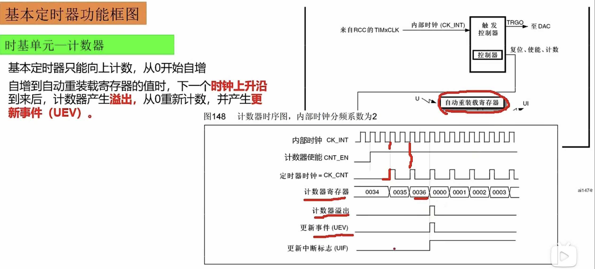
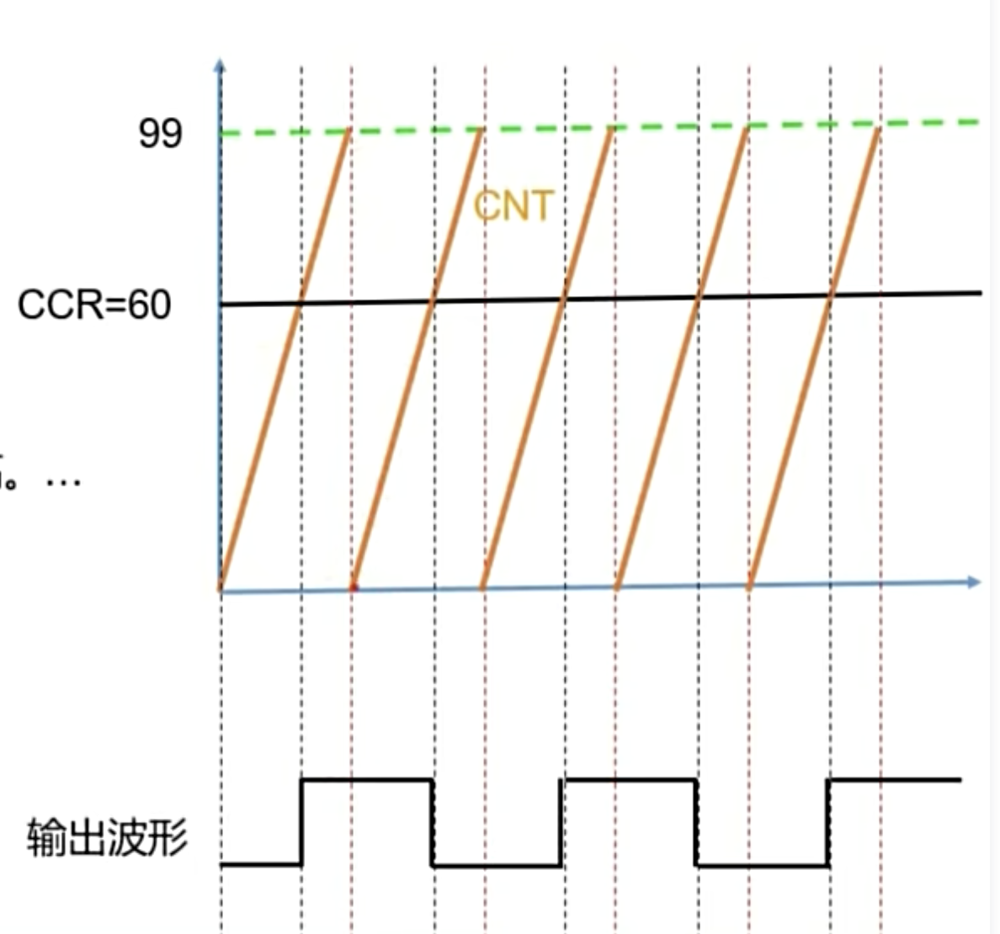

## 定时器
### 系统定时器 SysTick
#### 寄存器中断实现LED闪烁
```c
// 设置重装载值，每1ms产生一次中断
SysTick->LOAD = 72000 -1;
// 配置时钟源， AHB=72MHZ
SysTick->CTRL |= SysTick_CTRL_CLKSOURCE_Msk;
// 使能中断
SysTick->CTRL |= SysTick_CTRL_TICKINT_Msk;
// 开启定时器
SysTick->CTRL |= SysTick_CTRL_ENABLE_Msk;
// 回调函数
uint16_t sysCount = 0;
void SysTick_Handler(void)
{
    sysCount++;
    if (sysCount == 1000)
    {
        HAL_GPIO_TogglePin(LED0_PIN_PORT,LED0_PIN);
        // LED_Toogle(LED1_PIN);
        sysCount = 0;
    }
}
```
#### HAL实现LED闪烁
默认配置好就是开启并配置好了系统时钟定时器，1ms中断一次，全局变量累加  
中断回调函数在[SysTick_Handler](Core/Src/stm32f1xx_it.c)文件中  
代码同上
### 2基本定时器
TIM6和TIM7各包含一个16位自动装载计数器，各自独立可编程预分频器驱动，只能向上计数，没有外部IO，功能：定时中断、主模式、触发DAC。  
只有一种时钟源内部时钟源一般为72MHz。  
 基本定时器只能向上计数，从0开始自增到自动重装载寄存器的值时，下一个时钟上升沿到来后，计数器产生溢出，从0重新计数，并产生新事件UEV
 
自动重载寄存器有一个影子寄存器，中途更改计数规则，等到影子计数器一个周期完成后才执行重载寄存器规则  
#### 计算定时时间
1. 计数器的时钟频率是多少：预分频系数+1表示真正的分频值。  
频率=内部时钟频率/(预分频系数+1) 例如内部时钟频率为72MHz = 72000000Hz,预分频系数为7199，则计数器时钟频率为 10000 ，表示一秒钟计数1万次
2. 计数器的周期是多少，也就是累加一次需要多少时间  
(预分频系数+1)/内部时钟频率 
3. 计数器累加多少次产生一次更新时间  
自动重装载值+1，假设自动重装载值是3，则加到4时溢出到0
4. 所以定时时间  
(预分频系数+1)/内部时钟频率 * (自动重装载值+1)
5. 假设定时1秒，内部时钟频率72MHz  
方便计算，令预分频系数 7200-1=7199，计数器频率为10000，则自动重装载值=10000-1
#### 案例，LED闪烁
stm32f103c8t6 定时器只有1（高级）,2，3，4（通用）
##### 寄存器实现
```c
// 定时器使能 
  RCC->APB1ENR |= RCC_APB1ENR_TIM6EN;
  //设置预分频值7199，做7200分频  得到10000Hz
  TIM6->PSC = 7199;
  // 设置自动重装载值9999，表示计数10000次产生一个UEV
  TIM6->ARR = 9999;
  // 更新中断使能
  TIM6->DIER |= TIM_DIER_UIE;
  // 配置NVIC
  NVIC_SetPriorityGrouping(3);
  NVIC_SetPriority(TIM6_IRQn,2);
  NVIC_EnableIRQ(TIM6_IRQn);

  // 开启定时器
  TIM6->CR1 |= TIM_CR1_CEN;


void TIM6_IRQnHandler()
{
  // 清除中断标志
  TIM6->SR &= ~TIM_SR_UIF;
  HAL_GPIO_TogglePin(LED0_PIN_PORT,LED0_PIN);
  LED_Toogle(LED1_PIN);
}
```
##### HAL实现

```c
// 打开带有中断使能的计时器
HAL_TIM_Base_Start_IT(&htim6);
// 回调
void HAL_TIM_PeriodElapsedCallback(TIM_HandleTypeDef *htim)
{
    if(htim->Instance == TIM6){

    }
}
```
初始化时会初始化影子寄存器，一上来就会溢出，发生中断。
### 4个通用定时器 TIM2,3,4
TIM2,3,4,5 ，他们拥有基本定时器的所有功能，并增加以下功能：
1. 多种时钟源
  * 默认内部时钟模式 72MHz
  * 外部时钟源模式1，使用定时器自身通道的输入信号作为时钟源，每个定时器有4个输入通道，只有通道1和通道2的信号可以作为时钟信号源。
  * 外部时钟源模式2，使用定时器的特殊引脚ETR引脚的信号作为时钟源，每个通用定时器都有一个ETR引脚，比如TIM3的ETR引脚是PD2,ETR引脚信号经过极性选择，边缘检测，与、预分频器，输入滤波，得到信号ETRF  
  外部时钟源一般用于定时器级联。默认就是内部时钟源
2. 向上计数、向下计数、向上向下计数
3. 输入捕获
4. 输出比较
用来控制输出方波，也可以输出其他方波，但只能是方波。  
5. PWM生成
PWM（脉冲宽度调制Pulse-with modulation） 是利用微处理器的数字输出来对模拟电路进行控制的一种非常有效的技术，通常用在控制电机LED亮度调节，要求被控制电路必须要有一定的’惯性‘，电路中的负载状态不会发生突变。  
周期：连续两个上升沿或下降沿之间的宽度，用T表示。  
频率：1/T。  
占空比：高电平宽度t除以周期T：t/T，真正影响亮度。  
在使用PWM驱动惯性电器时，一般不改变频率和周期的。  
6. 支持针对定位的增量（正交）编码器和霍尔传感器电路  

捕获比较寄存器 CCR，每个定时器有四个，可以同时实现4路比较
#### 输出比较原理
8种模式：由CCMR1寄存器OC1M[2,0]共三位来控制，假设寄存器的值是CNT，比较寄存器1的值是CCR=60：
* OC1M = 000 输出冻结，比较结果不影响输出  
* 001 强制输出高电平，一旦CNT=CCR，强制输出高电平，不变化。
* 010 强制输出低电平，一旦CNT=CCR，强制输出低电平，不变化。
* 011 输出翻转，一旦CNT=CCR，则翻转输出，高变低 低变高。输出的结果是一个方波，频率为计数器的溢出频率的一半，占空比为50%。

CNT 向上累加，到预定值溢出重新累计。
* 100 强制输出低电平，与比较无关
* 101 强制输出高电平，与比较无关
* 110 PWM模式1，CNT<CCR 输出的是高电平 CNT>=CCR 输出低电平，频率为计数器溢出频率相同，占空比就是CCR=60(%)
* 111 PWM模式2，CNT>=CCR 输出的是高电平 CNT<CCR
#### 寄存器实现呼吸灯

### 2个高级定时器 TIM1